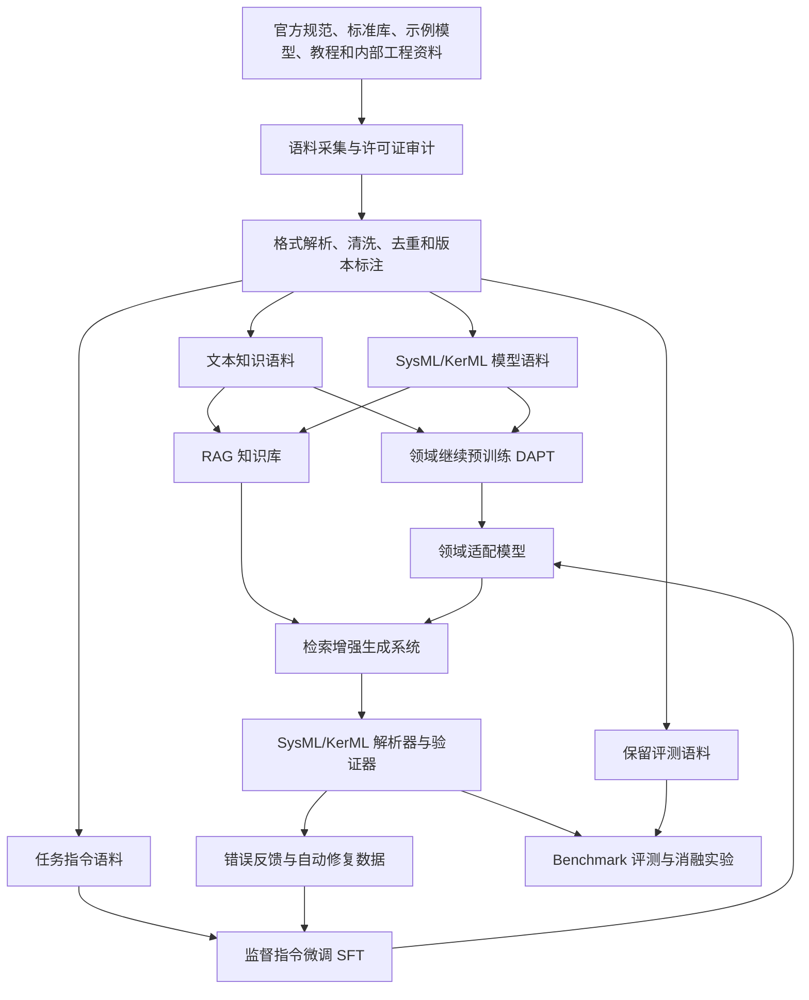

# 面向 SysML v2 领域建模的专用 GPT 技术路线

> 版本：v0.1  
> 日期：2026-06-01  
> 适用场景：科研开题、课题设计、技术预研、领域大模型训练方案设计  
> 核心目标：构建一个面向 SysML v2 / KerML 的领域智能模型，使其能够理解规范、生成模型、解释模型、修复错误，并支持中文需求到 SysML v2 文本模型的转换。

## 1. 研究背景与问题定义

SysML v2 是面向模型驱动系统工程（Model-Based Systems Engineering, MBSE）的新一代系统建模语言。与 SysML v1 相比，SysML v2 更强调形式化语义、文本化建模、图形化视图、标准 API、模型互操作和自动化处理能力。其底层由 KerML（Kernel Modeling Language）提供形式化建模基础，使系统结构、行为、需求、约束、接口和验证活动能够在更统一的语义框架下表达。

大语言模型已经表现出较强的自然语言理解和代码生成能力，但在 SysML v2 这类专业建模语言上仍存在明显不足：

- 对 SysML v2 术语、语法和语义规则掌握不足。
- 容易混淆 SysML v1、UML、SysML v2 和 KerML 概念。
- 生成模型时常出现语法错误、引用错误和结构不完整。
- 难以保证需求、结构、行为、约束和验证模型之间的一致性。
- 回答标准问题时容易产生没有规范依据的幻觉。

因此，本研究拟构建一个面向 SysML v2 的领域 GPT 技术体系。该体系不以从零训练通用大模型为目标，而是采用“通用基座模型 + 领域继续预训练 + 指令微调 + 检索增强 + 解析器反馈”的组合路线，在较低成本下提升模型的领域可靠性和工程可用性。

## 2. 研究目标

本研究的总体目标是构建一个面向 SysML v2 / KerML 的领域智能模型，并形成可复用的语料构建、训练、评测和迭代方法。

具体目标包括：

1. 构建 SysML v2 / KerML 分层领域语料库，覆盖规范、标准库、模型实例、教程解释、任务指令和评测基准。
2. 设计面向 SysML v2 的语料清洗、结构化、版本标注、许可证标注和语法验证流程。
3. 通过领域继续预训练提升模型对 SysML v2 语法、术语、模型结构和上下文分布的掌握。
4. 通过指令微调提升模型在需求建模、模型解释、模型修复、概念转换和规范问答任务上的能力。
5. 通过 RAG（Retrieval-Augmented Generation）接入官方规范、标准库和示例模型，降低模型幻觉并提升回答可追溯性。
6. 引入 SysML v2 / KerML 解析器或验证器，形成“生成-校验-修复”的闭环优化机制。
7. 构建 SysML v2 领域评测基准，对不同训练路线、数据配比和反馈机制进行消融实验。

## 3. 核心研究问题

本研究可围绕以下研究问题展开：

| 编号 | 研究问题 |
| --- | --- |
| RQ1 | SysML v2 领域语料应如何分层、清洗、标注和组织，才能同时支持模型学习规范知识、语法模式和建模任务？ |
| RQ2 | 领域继续预训练是否能够显著提升模型对 SysML v2 / KerML 文本语法、术语体系和模型组织方式的掌握？ |
| RQ3 | 指令微调是否能够提升模型在“需求到模型生成”“模型解释”“模型错误修复”“SysML v1 到 SysML v2 转换”等任务上的表现？ |
| RQ4 | RAG 是否能够提升规范问答、语法解释和建模建议的事实可靠性，并降低幻觉率？ |
| RQ5 | 引入解析器反馈的闭环训练或推理机制，是否能够降低 SysML v2 生成结果的语法错误率和引用错误率？ |
| RQ6 | 不同数据类型、数据配比、模型规模和训练策略对最终建模质量有何影响？ |

## 4. 总体技术路线

总体路线采用“语料工程先行、模型适配分层、工具反馈闭环、基准评测驱动”的研究范式。



推荐主线如下：

```text
官方语料库构建
-> SysML/KerML 语法验证
-> DAPT 领域继续预训练
-> SFT 指令微调
-> RAG 规范增强
-> Parser-in-the-loop 自动修复
-> Benchmark 评测与消融实验
```

## 5. 数据来源设计

截至 2026-06-01，优先参考以下公开来源：

| 来源 | 内容 | 用途 |
| --- | --- | --- |
| OMG SysML v2 官方页面 | SysML v2 标准说明、规范入口 | 规范权威来源 |
| SysML specifications 页面 | SysML v2.0、KerML、API 与服务、转换规范 | 标准文档下载与版本确认 |
| Systems-Modeling/SysML-v2-Release | 规范文档、标准库、示例模型、文本表示和 XMI 表示 | 核心训练语料 |
| Systems-Modeling/SysML-v2-Pilot-Implementation | 文本符号实现、编辑器、解析和验证能力 | 语法验证与工具链 |
| INCOSE / OMG / MBSE 公开材料 | 教程、案例、建模方法 | 教学解释语料 |
| 公开论文与技术报告 | SysML v2 建模、LLM 辅助 MBSE、语义对齐等研究 | 研究背景与任务设计 |
| 内部工程资料 | 需求文档、接口文档、验证计划、旧模型 | 面向真实工程任务的适配数据 |

建议优先级如下：

1. 官方规范与标准库。
2. 官方示例与经过解析器验证的模型。
3. 高质量教程、论文和工程案例。
4. 内部工程资料。
5. 合成任务数据。
6. 低置信度网络资料仅作为参考，不直接进入核心训练集。

所有数据源必须记录元信息：

```json
{
  "source_name": "Systems-Modeling/SysML-v2-Release",
  "source_url": "https://github.com/Systems-Modeling/SysML-v2-Release",
  "retrieved_at": "2026-06-01",
  "version": "release tag or commit sha",
  "license": "EPL-2.0 or source-specific license",
  "allowed_usage": "research / internal / commercial review required",
  "data_type": "specification | model | library | tutorial | paper | internal",
  "notes": "Keep exact version to avoid mixing Beta and formal specifications."
}
```

## 6. 分层语料体系

语料不应简单混合，而应按照知识来源、任务类型和训练用途分层组织。

| 层级 | 名称 | 内容 | 作用 |
| --- | --- | --- | --- |
| L1 | 标准规范层 | SysML v2、KerML、API、转换规范 | 学习权威概念、语义规则、术语体系 |
| L2 | 标准库层 | SysML/KerML 标准库、基础类型、单位、关系 | 学习可复用建模元素 |
| L3 | 模型实例层 | 官方示例、公开模型、内部工程模型 | 学习真实模型组织结构 |
| L4 | 教学解释层 | 教程、论文、讲义、案例说明 | 学习解释、类比和教学表达 |
| L5 | 任务指令层 | 生成、修复、转换、问答、摘要、对齐 | 学习交互式任务能力 |
| L6 | 评测基准层 | 保留测试集、专家标注样本、解析器验证样本 | 客观评估，不参与训练 |

建议目录结构：

```text
corpus/
  raw/
    official_specs/
    official_release_repo/
    pilot_implementation/
    examples/
    papers/
    tutorials/
    internal_docs/
    synthetic/
  extracted/
    markdown/
    sysml/
    kerml/
    xmi/
    tables/
    diagrams_ocr/
  normalized/
    documents.jsonl
    models.jsonl
    instruction_pairs.jsonl
    parser_feedback.jsonl
    validation_cases.jsonl
  splits/
    dapt_train.jsonl
    dapt_valid.jsonl
    sft_train.jsonl
    sft_valid.jsonl
    rag_corpus.jsonl
    eval.jsonl
  metadata/
    sources.csv
    licenses.csv
    versions.csv
    dedup_report.json
    parser_report.json
```

## 7. 语料处理流程

### 7.1 采集

采集阶段强调版本固定、来源可追溯和许可证可审计。

- 对官方 GitHub 仓库使用 release tag 或 commit sha 固定版本。
- 对 PDF 规范保存原始文件、下载日期和来源 URL。
- 对 `.sysml`、`.kerml`、`.sysmlx`、`.kermlx`、`.xmi` 文件保留原始格式。
- 对内部资料进行脱敏、权限审查和用途标注。
- 对合成数据记录生成模型、提示词模板和人工审核状态。

### 7.2 解析

不同格式采用不同解析策略：

| 格式 | 处理方式 |
| --- | --- |
| PDF | 转 Markdown，保留章节号、标题层级、表格和代码块 |
| Markdown / HTML | 清除导航和样式噪声，保留标题结构 |
| `.sysml` / `.kerml` | 原样保留，同时按 package 和定义块切分 |
| XMI | 解析为结构化元素、关系和属性，也可转为图三元组 |
| 表格 | 转为结构化 JSON 或 Markdown 表 |
| 图像 / 图表 | 仅在必要时 OCR，优先保留图注和上下文 |

### 7.3 清洗

清洗规则包括：

- 删除页眉、页脚、目录重复、版权页重复和导航文本。
- 保留规范章节号、条款编号和术语定义。
- 保留 SysML/KerML 代码块的缩进、标点和换行。
- 删除无法确认来源或许可证的文本。
- 对旧版 Beta 资料增加显式版本标签，不与正式 v2.0 样本混淆。
- 去除重复样本，区分完全重复和近似重复。

### 7.4 结构化

推荐统一使用 JSONL 存储规范化样本：

```json
{
  "id": "sysml-v2-release-2026-04-example-0001",
  "source": "Systems-Modeling/SysML-v2-Release",
  "source_url": "https://github.com/Systems-Modeling/SysML-v2-Release",
  "retrieved_at": "2026-06-01",
  "version": "2026-04 or exact commit sha",
  "license": "EPL-2.0",
  "data_type": "sysml_model",
  "language": "sysml",
  "task": "continued_pretraining",
  "parser_status": "passed",
  "text": "package VehicleModel { ... }"
}
```

中文任务样本可采用如下结构：

```json
{
  "id": "zh-req-to-sysml-0001",
  "task": "requirement_to_sysml",
  "instruction_zh": "根据下面需求生成 SysML v2 文本模型。",
  "input_zh": "系统包含电池、控制器和电机，控制器向电机发送扭矩指令。",
  "output_sysml": "package EVSystem { ... }",
  "explanation_zh": "该模型使用 part def 表达系统组成，使用 connection 表达部件之间的连接。",
  "parser_status": "passed",
  "review_status": "human_reviewed"
}
```

### 7.5 语法验证

对 SysML/KerML 模型样本进行自动验证：

- 使用 SysML v2 Pilot Implementation 或可用解析器进行解析。
- 记录解析器版本、执行命令、错误类型和错误位置。
- 通过样本进入高置信训练集。
- 失败样本进入错误修复集，而不是直接丢弃。

错误反馈样本结构：

```json
{
  "id": "parser-feedback-0001",
  "task": "sysml_error_repair",
  "bad_model": "package Example { part def Vehicle ... }",
  "parser_error": "Syntax error near token ...",
  "fixed_model": "package Example { part def Vehicle { ... } }",
  "repair_type": "syntax_error",
  "parser_status_after_fix": "passed"
}
```

## 8. 模型训练方案

### 8.1 基线模型

首先建立基线系统：

| 基线 | 描述 | 目的 |
| --- | --- | --- |
| B0 | 通用 LLM + 直接提示 | 衡量通用模型原始能力 |
| B1 | 通用 LLM + 少样本提示 | 衡量 prompt engineering 效果 |
| B2 | 通用 LLM + RAG | 衡量检索增强对规范知识的作用 |

### 8.2 领域继续预训练

领域继续预训练（Domain-Adaptive Pretraining, DAPT）用于让模型熟悉 SysML v2 / KerML 的文本分布、术语、语法和模型组织方式。

训练数据包括：

- SysML v2 / KerML 规范文本。
- 标准库文本表示。
- 官方示例模型。
- 高质量公开模型。
- 经过清洗的教程和技术说明。

建议数据配比：

| 数据类型 | 建议比例 |
| --- | ---: |
| SysML / KerML 模型代码 | 35% |
| 官方规范与标准库文本 | 25% |
| 官方示例与工程模型 | 20% |
| 教程、论文和解释文本 | 10% |
| 中英双语术语和概念说明 | 10% |

若使用小模型或 nanoGPT 风格实验，可以重点观察 tokenizer、上下文长度、模型规模和语料配比对困惑度及生成语法正确率的影响。

### 8.3 指令微调

监督指令微调（Supervised Fine-Tuning, SFT）用于提升任务执行能力。

核心任务包括：

| 任务 | 输入 | 输出 |
| --- | --- | --- |
| 需求到模型生成 | 自然语言需求 | SysML v2 文本模型 |
| 模型解释 | SysML/KerML 模型片段 | 中文或英文解释 |
| 模型补全 | 不完整模型上下文 | 补全后的模型 |
| 错误修复 | 错误模型 + 解析器错误 | 修复后的模型 |
| 概念转换 | SysML v1 / UML 概念 | SysML v2 写法 |
| 规范问答 | 问题 + 检索上下文 | 带依据的回答 |
| 建模建议 | 系统工程场景 | 建模模式和结构建议 |
| 模型摘要 | 完整模型或 package | 结构化摘要 |

推荐 SFT 数据配比：

| 任务类型 | 建议比例 |
| --- | ---: |
| 需求到 SysML v2 生成 | 30% |
| 模型解释与摘要 | 20% |
| 错误修复 | 20% |
| 规范问答 | 15% |
| SysML v1 到 v2 转换 | 10% |
| 建模风格与最佳实践 | 5% |

### 8.4 检索增强生成

RAG 不应替代训练，而应承担“动态知识、标准依据和可追溯回答”的职责。

RAG 知识库建议包含：

- SysML v2 正式规范。
- KerML 正式规范。
- SysML v2 API and Services。
- SysML v1 to v2 Transformation Specification。
- 标准库说明和代码片段。
- 官方示例模型。
- 经审核的内部建模规范。

检索单元建议按语义结构切分：

- 规范：按章节、术语定义、语法规则和语义约束切分。
- 模型：按 package、definition、usage、requirement、action、connection 切分。
- 教程：按概念、示例、步骤和注意事项切分。

回答格式建议强制包含：

```text
结论
依据
SysML v2 示例
注意事项
来源引用
```

### 8.5 Parser-in-the-loop 闭环

在推理阶段引入解析器反馈：

```text
用户需求
-> 模型生成 SysML v2
-> 解析器检查
-> 若通过：返回模型与解释
-> 若失败：将错误信息反馈给模型
-> 模型修复
-> 再次检查
-> 返回最终结果和剩余风险
```

该机制可用于：

- 提升生成结果语法正确率。
- 自动构造错误修复训练数据。
- 分析模型常见错误。
- 支持自我迭代优化。

## 9. 关键技术点

### 9.1 领域 tokenizer 分析

需要分析通用 tokenizer 对 SysML v2 关键词和符号的切分情况，例如：

```text
part def
requirement def
ref part
perform action
constraint def
interface def
connection def
attribute def
```

研究指标包括：

- 平均 token 压缩率。
- SysML 关键词切分粒度。
- 模型文件平均上下文占用。
- tokenizer 适配前后困惑度变化。

### 9.2 多粒度模型理解

SysML v2 建模能力需要覆盖多种粒度：

| 粒度 | 目标 |
| --- | --- |
| token 级 | 掌握语法符号、关键词和命名模式 |
| 语句级 | 掌握定义、使用、连接、约束和关系表达 |
| package 级 | 掌握模型模块化组织 |
| 视角级 | 掌握需求、结构、行为、验证视角之间的映射 |
| 系统级 | 保证模型整体一致性和需求覆盖 |

### 9.3 版本控制与标准一致性

SysML v2 资料存在 Beta、正式版、增量 release 和工具实现差异。必须建立版本标注机制：

- 训练样本必须带版本字段。
- 评测集应以正式规范为准。
- 旧版资料可保留，但必须标明“legacy / beta”。
- RAG 检索时优先返回最新正式规范和当前指定版本资料。

### 9.4 知识记忆与知识检索分离

模型训练负责学习建模能力和语言模式；RAG 负责提供可更新的规范知识和来源依据。这样可以避免模型死记旧规范，也方便标准更新后替换知识库。

## 10. 实验设计

### 10.1 对比路线

| 路线 | 方法 | 目的 |
| --- | --- | --- |
| Route 0 | 通用 LLM + Prompt | 原始能力基线 |
| Route 1 | 通用 LLM + RAG | 验证规范检索效果 |
| Route 2 | 通用 LLM + DAPT | 验证领域继续预训练效果 |
| Route 3 | 通用 LLM + SFT | 验证任务指令学习效果 |
| Route 4 | 通用 LLM + DAPT + SFT | 验证领域适配组合效果 |
| Route 5 | 通用 LLM + DAPT + SFT + RAG | 主路线 |
| Route 6 | 主路线 + Parser-in-the-loop | 验证解析器反馈闭环效果 |

### 10.2 消融实验

建议设置以下消融实验：

| 实验 | 对比变量 |
| --- | --- |
| E1 | 无 RAG vs 有 RAG |
| E2 | 无 DAPT vs 有 DAPT |
| E3 | 无 SFT vs 有 SFT |
| E4 | 无解析器反馈 vs 有解析器反馈 |
| E5 | 官方语料 vs 官方语料 + 合成语料 |
| E6 | 低模型代码比例 vs 高模型代码比例 |
| E7 | 通用 tokenizer vs 领域 tokenizer |
| E8 | 固定切块 vs 语义结构切块 |
| E9 | 中文任务少量数据 vs 中文任务增强数据 |
| E10 | 单轮生成 vs 多轮修复生成 |

### 10.3 评价任务

评测任务应覆盖知识、生成、解释、修复和一致性。

| 任务 | 描述 |
| --- | --- |
| T1 规范问答 | 回答 SysML v2 语法和语义问题 |
| T2 需求建模 | 将自然语言需求转为 SysML v2 模型 |
| T3 模型解释 | 解释给定模型片段的含义 |
| T4 模型补全 | 根据上下文补全缺失定义或连接 |
| T5 错误修复 | 修复语法错误、引用错误或结构错误 |
| T6 SysML v1 到 v2 转换 | 将旧概念或片段转换为 v2 表达 |
| T7 模型摘要 | 提取模型中的部件、接口、行为和需求 |
| T8 需求覆盖检查 | 判断模型是否覆盖给定需求 |

## 11. 评测指标体系

| 维度 | 指标 |
| --- | --- |
| 语法正确性 | Parser pass rate、语法错误数量、错误类型分布 |
| 语义一致性 | 引用解析成功率、类型一致性、关系一致性 |
| 需求覆盖 | 需求点召回率、遗漏率、误建模率 |
| 生成质量 | 专家评分、模型完整性、命名规范性 |
| 修复能力 | 修复成功率、平均修复轮数、残留错误率 |
| 问答可靠性 | 答案准确率、引用准确率、幻觉率 |
| RAG 效果 | 检索命中率、上下文相关性、答案可追溯性 |
| 中文适配 | 中文需求理解准确率、术语翻译一致性 |
| 工程可用性 | 可读性、模块化程度、可维护性 |

专家评分可采用 1 到 5 分 Likert 量表：

| 分数 | 含义 |
| --- | --- |
| 1 | 完全错误或不可用 |
| 2 | 部分相关，但存在严重语法或语义问题 |
| 3 | 基本可用，但需要人工较多修改 |
| 4 | 质量较好，仅需少量修订 |
| 5 | 正确、完整、清晰，可直接作为建模基础 |

## 12. 预期创新点

1. 提出面向 SysML v2 / KerML 的分层领域语料构建方法，覆盖规范、标准库、模型、任务和评测基准。
2. 构建“规范文本 + 模型代码 + 解析器反馈”的复合训练闭环。
3. 将 DAPT、SFT、RAG 和 Parser-in-the-loop 结合，用于工程建模语言大模型适配。
4. 建立面向 SysML v2 的生成与理解评测基准，覆盖语法、语义、需求覆盖和工程可用性。
5. 支持中文自然语言需求到 SysML v2 文本模型的跨语言建模能力。
6. 形成可迁移到 AADL、Modelica、UML、Capella/Arcadia 等建模语言的领域模型训练方法。

## 13. 风险与应对策略

| 风险 | 表现 | 应对策略 |
| --- | --- | --- |
| 高质量语料不足 | 可训练模型样本数量有限 | 强化官方示例、内部模型、合成数据和 parser feedback 数据 |
| 许可证限制 | 语料不能直接用于商业训练 | 建立 license audit，区分研究、内部和商业可用数据 |
| 标准版本混乱 | Beta 与正式版混用 | 每条样本记录版本，评测以正式规范为准 |
| 生成结果语法错误 | 模型输出无法解析 | 引入 parser-in-the-loop 和错误修复微调 |
| 模型幻觉 | 编造不存在的语法或规范条款 | 使用 RAG 和来源引用约束 |
| 语义评测困难 | Parser 通过但建模不合理 | 引入专家评分和需求覆盖检查 |
| 中文需求歧义 | 中文描述转模型不稳定 | 建立中文需求模板、术语表和人工审核样本 |
| 数据泄露 | 内部工程资料包含敏感信息 | 脱敏、权限控制、数据分级和审计 |

## 14. 阶段计划

| 阶段 | 时间 | 主要任务 | 产出 |
| --- | --- | --- | --- |
| 阶段 1 | 第 1-2 周 | 文献调研、官方资源梳理、许可证审计 | 资源清单、license 表、研究问题定义 |
| 阶段 2 | 第 3-5 周 | 原始语料采集、格式解析、清洗规则制定 | raw corpus、extracted corpus、清洗脚本 |
| 阶段 3 | 第 6-8 周 | 结构化数据 schema、去重、版本标注、解析器验证 | normalized JSONL、parser report |
| 阶段 4 | 第 9-11 周 | DAPT 数据集构造、小规模领域继续预训练 | DAPT 模型、训练日志、困惑度分析 |
| 阶段 5 | 第 12-14 周 | 指令数据构造、SFT、错误修复数据增强 | SFT 模型、任务数据集、修复样本 |
| 阶段 6 | 第 15-16 周 | RAG 知识库、检索策略、引用格式 | RAG 原型、知识库索引 |
| 阶段 7 | 第 17-19 周 | Benchmark 构建、对比实验、消融实验 | 评测报告、误差分析 |
| 阶段 8 | 第 20 周 | 总结、论文/报告撰写、模型卡和数据卡 | 技术报告、论文初稿、模型卡、数据卡 |

## 15. 最小可行原型

若先做一个可运行原型，建议范围控制如下：

1. 只使用官方 SysML v2 / KerML 规范、标准库和示例模型。
2. 先构建 RAG 问答系统，支持规范问答和模型解释。
3. 构造 200 到 1000 条高质量 SFT 样本，覆盖需求到模型、模型解释和错误修复。
4. 接入解析器，对生成模型进行自动校验。
5. 建立 50 到 100 条专家评测样本，用于初步比较 baseline、RAG 和 SFT。

MVP 成功标准：

- 规范问答能够给出来源依据。
- 简单需求生成的 SysML v2 模型 parser pass rate 达到可观察提升。
- 错误修复任务能修复常见语法错误。
- 中文需求到模型的输出结构基本稳定。

## 16. 推荐实施顺序

推荐按以下顺序推进：

```text
1. 固定官方数据版本和许可证边界
2. 建立 corpus metadata schema
3. 采集并清洗官方规范、标准库和示例模型
4. 建立 SysML/KerML parser validation pipeline
5. 构造 DAPT 数据集并做小规模继续预训练
6. 构造 SFT 指令数据，优先覆盖需求生成、模型解释和错误修复
7. 建立 RAG 知识库和引用机制
8. 接入 parser-in-the-loop 推理修复
9. 建立 benchmark 与专家评分表
10. 开展消融实验和误差分析
```

## 17. 可引用资源

- OMG SysML v2: https://www.omg.org/sysml/sysmlv2/
- SysML specifications: https://sysml.org/sysml-specs/
- Systems-Modeling/SysML-v2-Release: https://github.com/Systems-Modeling/SysML-v2-Release
- Systems-Modeling/SysML-v2-Pilot-Implementation: https://github.com/Systems-Modeling/SysML-v2-Pilot-Implementation
- Systems-Modeling/SysML-v2-API-Services: https://github.com/Systems-Modeling/SysML-v2-API-Services

## 18. 结论

面向 SysML v2 的专用 GPT 不应仅被视为一个普通文本生成模型，而应被设计为“领域语料库 + 模型适配 + 标准检索 + 语法验证 + 评测基准”的综合系统。其关键不在于盲目扩大语料规模，而在于保证语料权威、版本明确、许可证清楚、结构可解析、任务可评测。

最具科研价值和工程可行性的路线是：

```text
分层语料构建
-> 领域继续预训练
-> 指令微调
-> RAG 规范增强
-> Parser-in-the-loop 闭环修复
-> Benchmark 驱动评测
```

该路线既能形成明确的研究贡献，也能产出可运行的 SysML v2 智能建模助手原型。
